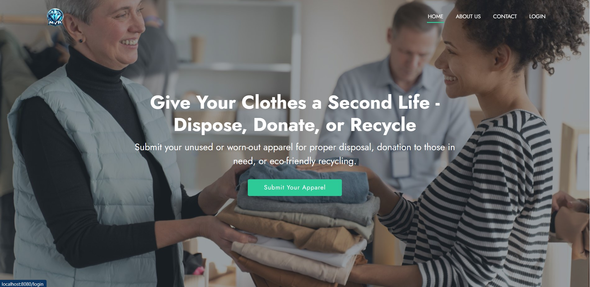

# MVP (Minimum Viable Product) Platform



# Table of Contents

1. [📖 Project Description](#-project-description)
2. [🛠️ Features Implemented](#-features-implemented)
3. [🚀 Technical Stack](#-technical-stack)
4. [📦 Project Setup and Installation Instructions](#-project-setup-and-installation-instructions)
   - [Prerequisites](#prerequisites)
   - [Installation Steps](#installation-steps)
5. [🏦 Project Structure](#-project-structure)
6. [📅 Database Initialization](#-database-initialization)
7. [📋 How to Use the Platform](#-how-to-use-the-platform)
   - [Registration](#registration)
   - [Login](#login)
   - [Submit Apparel](#submit-apparel)
   - [Edit Apparel](#edit-apparel)
   - [Delete Apparel](#delete-apparel)
   - [View Apparel](#view-apparel)
   - [View All Apparel](#view-all-apparel)
8. [👉 API Endpoints](#-api-endpoints)
9. [🧪 API Testing](#-api-testing)
10. [👩‍💻 Code Overview](#-code-overview)
    - [Controllers](#controllers)
    - [Models](#models)
    - [Services](#services)
    - [Repository Layer](#repository-layer)
11. [🤝 Contributing](#-contributing)
12. [⭐️ Show your support](#-show-your-support)
13. [📝 License](#-license)


## 📖 Project Description

This project is a Minimum Viable Product (MVP) for an Apparel Donation and Recycling Platform. The platform allows users to donate, recycle, or dispose of unwanted apparel. Each item is listed with details such as condition, quantity, category, and description, with image uploads. Users can view, post, and manage apparel, as well as contact platform administrators through a simple contact form.

This project is an **Apparel Recycling Platform** where users can submit, edit, and manage their recycled apparels. The platform allows users to register and log in, create apparel listings, view all available apparel, and manage their own listings (edit and delete). The application is built using **Spring Boot**, **Thymeleaf**, and **Hibernate (JPA)** for database interactions.

## 🛠️ Features Implemented

1. **User Registration and Authentication**:
   - Users can register for an account.
   - Existing users can log in using their email and password.
   - Session-based authentication to track the logged-in user.
   - User can log out and end their session.

2. **Apparel Management**:
   - Users can submit new apparel items for recycling, donation and disposal with fields like name, description, category, condition, and status.
   - Users can view all available apparel items on the platform.
   - Logged-in users can view and manage (edit/delete) the apparel items they have created.
   
3. **Session-Based User Management**:
   - The current logged-in user's information is stored in the session using `@SessionAttributes`, allowing personalized interactions.
   
4. **User-Specific Apparel Listings**:
   - Logged-in users can view, edit, and delete only the apparel items they have submitted.

5. **Status Tracking**:
   - When an apparel is submitted, it is marked as "Pending" by default, allowing for future moderation or approval features.

6. **Apparel Details**:
   - A detailed view for each apparel item, showcasing:
     - Name, description, category, condition, quantity, status (Pending, Processed).
     - A relative timestamp for when the apparel was posted (e.g., "5 minutes ago").
     - Display of the poster’s name.
     - Item image displayed in full resolution.

7. **Contact Form**:
   - A contact form is available for users to send inquiries, issues, or feedback, including:
     - Subject of the inquiry.
     - Detailed message.
   
8. **About Us Page**:
- A simple page with information about the platform, its mission, and contact details.
- This page is accessible from the main menu.
## 🚀 Technical Stack

- **Backend**: Java, Spring Boot, Hibernate (JPA)
- **Frontend**: Thymeleaf (HTML templates), Bootstrap, HTML, CSS
- **Database**: MySQL
- **Build Tool**: Maven
- **Image Handling**: Images are stored as `byte[]` directly in the database.
- **Time Formatting**: Java `LocalDateTime` is used to display timestamps, with human-readable time formatting (e.g., "5 minutes ago").


## 📦 Project Setup and Installation Instructions

### Prerequisites

To set up and run this project, ensure you have the following installed:
- **Java 17 or higher**: [Download Java](https://www.oracle.com/java/technologies/javase-jdk11-downloads.html)
- **Maven**: [Download Maven](https://maven.apache.org/install.html)
- **MySQL** (or any other database): You need to have a running MySQL instance.
- **IDE**: Any Java IDE (Eclipse, IntelliJ IDEA, NetBeans) for development and testing.

### Installation Steps

1. **Clone the repository**

   ```bash
   git clone https://github.com/your-username/apparel-mvp-platform.git
   ```
2. **Create a MySQL Database**
- Create a new database named `mvp_platform` in your MySQL instance.

    ```bash
    CREATE DATABASE apparel_mvp;
    ```

3. **Update Database Credentials**
- Open the `src/main/resources/application.properties` file and update the database connection settings with your MySQL credentials:

    ```bash
    spring.datasource.url=jdbc:mysql://localhost:3306/mvp_platform
    spring.datasource.username=root
    spring.datasource.password=your_password

    spring.jpa.hibernate.ddl-auto=update
    spring.jpa.show-sql=true
    ```

4. **Build the Project**
- Navigate to the project root folder and run the Maven build command:

    ```bash
    mvn clean install
    ```
5. **Run the Application** 
- After building, run the Spring Boot application using the following command:

    ```bash
    mvn spring-boot:run
    ```

6. **Access the Application**
- Open a browser and navigate to:

    ```bash
    http://localhost:8080
    ```

## 🏦 Project Structure

The project follows the standard Spring Boot MVC structure:


## 📅 Database Initialization

1. **Users**
- You can register a new user from the platform’s registration page.
- The user’s information will be stored in the `users` table in the database.

2. **Apparels**
- After logging in, you can submit, edit, and delete apparel from the appropriate pages.
- The apparel information will be stored in the `apparels` table in the database.

## 📋 How to Use the Platform

### Registration
- Go to the registration page and fill in the required information. Click on the
“Register” button to create a new user account.

### Login
- Go to the login page and enter your username and password. Click on the
“Login” button to access the platform.

### Submit Apparel
- After logging in, go to the “Submit Apparel” page and fill
in the required information. Click on the “Submit” button to add a new apparel to the database.

### Edit Apparel
- Go to the “Edit Apparel” page and select the apparel you want
to edit. Make the necessary changes and click on the “Save” button to update the apparel information.

### Delete Apparel
- Go to the “Delete Apparel” page and select the apparel you want
to delete. Click on the “Delete” button to remove the apparel from the database.

### View Apparel
- Go to the “View Apparel” page and select the apparel you want
to view. You can view the apparel information and details.

### View All Apparel
- All users (even guests) can view the list of available apparel items on the homepage.

## 👉 API Endpoints
| Method | Endpoint | Description |
| --- | --- | --- |
| POST | /register | Create a new user account |
| POST | /login | Login to the platform |
| POST | /new | Submit a new apparel |
| GET | /apparels | View all apparels |
| GET | /apparels/{id} | View a specific apparel by ID |
| PUT | /apparels/{id} | Edit a specific apparel by ID |
| DELETE | /apparels/{id} | Delete a specific apparel by ID |

## 🧪 API Testing
The API testing is done using Postman and JUnit.

## 👩‍💻 Code Overview

### Controllers

1. **HomeController** : Manages the display of all available apparels on the index page.
2. **ApparelController** : Handles CRUD operations related to apparel (submit, edit, delete, view my apparel).
3. **UserController** : Manages user login, registration, and session management.
   

### Models

1. **User** : Represents a user in the system, including fields like id, email, password, username.
2. **Apparel** : Represents an apparel item submitted by a user, with fields like id, name, description, category, condition, status, and a reference to the User who submitted it.

### Services

1. **ApparelService** : Provides business logic for apparel-related operations, such as fetching all apparel, fetching a user's apparel, and saving/deleting apparel.
2. **UserService** : Handles user-related operations such as finding users by email and saving new users.

### Repository Layer
1. **ApparelRepository** : Extends JpaRepository and provides methods to fetch apparel by user.
2. **UserRepository** : Extends JpaRepository and provides methods to fetch users by email.

## 🤝 Contributing 

Contributions, issues, and feature requests are welcome! Feel free to check the [issues page](/issues).

## ⭐️ Show your support 

Give a ⭐️ if you like this project!


## 📝 License


MIT (c) [Keerti](https://github.com/keerti1924)
